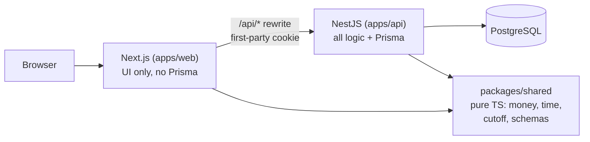
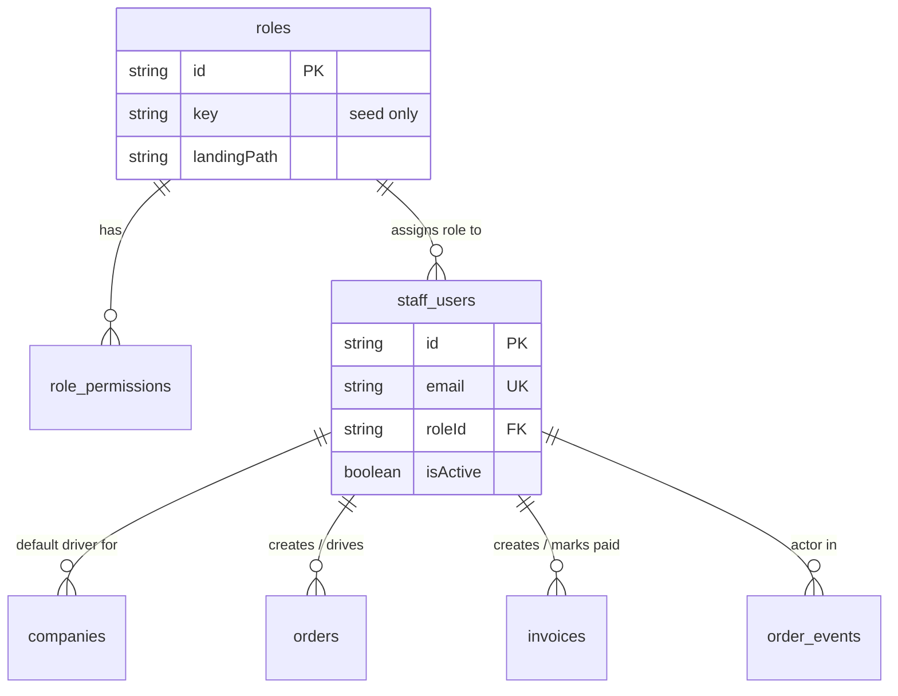
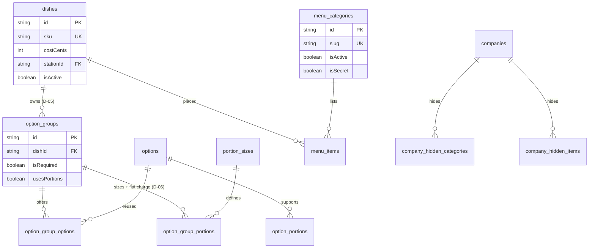
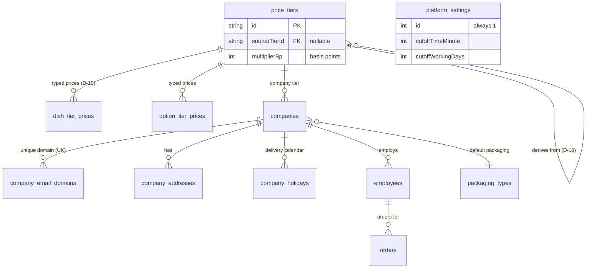
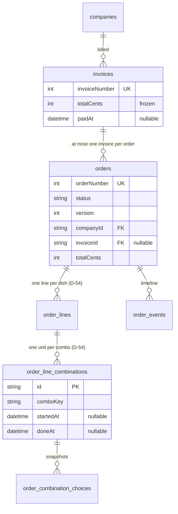

# Fernleaf Kitchen — Operations Admin Panel

Internal admin panel for Fernleaf Kitchen (fictional), a commercial kitchen running corporate meal
programs. Companies sign up, staff create boxed-meal orders on behalf of employees inside this panel,
the kitchen cooks them, dispatch delivers them, and every order is billed to the employee's company.
There is no customer-facing app; staff do everything here.

- Live app: https://kitchen-fernleaf.vercel.app/
- API: https://kitchen-fernleaf.vercel.app/api/health
- Repository: https://github.com/darshilptl/fernleaf-kitchen

The PDF assignment is the only definition of scope (`docs/assignment.txt`). Reviewers grade the data
model, rule enforcement, and correctness above screens (see `AGENTS.md`).

## Status

| PDF section              | Scope                                                                                                                                    | Status | Evidence                                                                                                                  |
| ------------------------ | ---------------------------------------------------------------------------------------------------------------------------------------- | ------ | ------------------------------------------------------------------------------------------------------------------------- |
| §3 Roles and access      | One role per staff user, server-enforced permission keys                                                                                 | Built  | `apps/api/src/modules/auth/`, `packages/shared/src/permissions.ts`                                                        |
| §4.1 Catalogue           | Dishes, options, option groups, portions [Should], reference lists, snapshots                                                            | Built  | `apps/api/src/modules/catalogue/`, `apps/web/src/features/catalogue/`, `apps/web/src/app/(staff)/admin/catalogue/`        |
| §4.2 Menu                | Categories, items, hiding, secret categories, employee preview                                                                           | Built  | `apps/api/src/modules/menu/` (`GET /api/menu/preview`), `apps/web/src/features/menu/`                                     |
| §4.3 Pricing             | Named tiers, default tier, derivation, rounding, tier grid                                                                               | Built  | `apps/api/src/modules/pricing/`, `apps/web/src/features/pricing/`                                                         |
| §4.4 Companies           | Domains, addresses, calendar, delivery defaults, tier, hiding                                                                            | Built  | `apps/api/src/modules/companies/`, `apps/web/src/features/companies/`                                                     |
| §4.5 Employees           | Flags, allergies/preferences, CSV import [Should]                                                                                        | Built  | `apps/api/src/modules/employees/` (`POST /api/companies/:companyId/employees/import`), `apps/web/src/features/employees/` |
| §4.6 Orders              | Create/place/edit/cancel/reject, cut-off processing + manual trigger, list/detail                                                        | Built  | `apps/api/src/modules/orders/`, `apps/web/src/features/orders/`                                                           |
| §4.7 Kitchen board       | Prep units, start/done, force-complete, planned times, late/at-risk                                                                      | Built  | `apps/api/src/modules/kitchen/`, `apps/web/src/features/kitchen/`, `apps/web/src/app/(staff)/kitchen/dashboard/`          |
| §4.8 Dispatch and driver | Drop grouping, driver assignment, dispatch steps, driver view                                                                            | Built  | `apps/api/src/modules/dispatch/`, `apps/web/src/features/dispatch/`, `apps/web/src/features/driver/`                      |
| §4.9 Billing             | Billable orders, invoices, mark paid, remove from invoice                                                                                | Built  | `apps/api/src/modules/billing/`, `apps/web/src/features/billing/`, `apps/web/src/app/(staff)/admin/billing/`              |
| §4.10 Settings           | Kitchen calendar, cut-off time/day count, platform values                                                                                | Built  | `apps/api/src/modules/settings/`, `apps/web/src/features/settings/`                                                       |
| §4.11 Dashboards         | Admin figures A1-A4 as API + page; kitchen/dispatch/driver boards are the operational dashboards (K/P/R defined, rendered by the boards) | Built  | `apps/api/src/modules/dashboards/`, `apps/web/src/features/dashboard/`, `apps/web/src/app/(staff)/admin/dashboard/`       |

Group 4 (kitchen, dispatch, billing) is built end to end: the kitchen board, dispatch board,
driver view, and billing screens are real pages backed by real-database specs, and the admin
dashboard serves figures A1-A4 (`docs/dashboards.md`). Group 5 adds seed part 2 (orders in every
status, driver drops, invoices), the demo-data boot hook with an admin refresh action, and this
README. Kitchen/dispatch/driver role screens are their operational boards; figure definitions
live in `docs/dashboards.md`.

## A note on timing

The deadline was 4 Oct 2026 11:59 PM IST and this version was completed about
3 after it. The time went into
the parts hardest to fix later: database-level constraints
(`apps/api/prisma/migrations/20261004004750_constraints/migration.sql`), pure domain functions that
take `now` as a parameter so tests control time, and tests against a real database. There is no
`deadline-snapshot` tag in this repository (`git tag` returns nothing), so
there is no separate snapshot to compare against; the commit history is the record.

## Test accounts

| Role     | Email             | Password  |
| -------- | ----------------- | --------- |
| Admin    | admin@test.com    | Test@1234 |
| Kitchen  | kitchen@test.com  | Test@1234 |
| Dispatch | dispatch@test.com | Test@1234 |
| Driver   | driver@test.com   | Test@1234 |

Each account holds exactly one role; permissions are re-loaded from the database on every request, so
role changes and deactivation apply immediately (D-02). The accounts are created by
`ensureBaseData` (`apps/api/src/modules/auth/base-data.ts`, password `Test@1234`) and re-asserted on every boot so reviewer
logins keep working even if rows drift (D-79). Minimum staff password length is 8 characters (D-78).

## Suggested 5-minute tour per role

Admin (`admin@test.com`): sign in, open Companies, pick a company to see domains, addresses,
calendar, and tier. Acme Foods has one domain, two addresses (HQ default plus Warehouse), a Friday
holiday, and six people (owner Riya Shah plus five employees). Try adding `gmail.com` (public-domain
blocklist) or a domain another company owns: both are rejected. Open Pricing to see the tier grid
and dishes missing a price: Standard is typed and default, Enterprise derives from Standard at
+15%, Partner derives from cost at x2.4; Overnight Oats Jar has no Standard price, so it is
missing on Standard and Enterprise but priced on Partner. Open Menu preview and compare Riya Shah
(Acme, Enterprise) with Ishaan Gupta (Initech, Partner): different prices for the same dishes.
Maya Rao (Globex) has no Desserts category (hidden); Initech hides one dessert item (Gulab Jamun).
The secret `chefs-table` category opens by slug. Open Orders, filter
by status and company, open an order for lines, money breakdown, and timeline. Run cut-off processing
from the orders screen (`POST /api/orders/cutoff/run`); running it twice changes nothing the
second time. Settings holds kitchen working days,
holidays, cut-off time, and day count, plus the demo-data refresh action.

Kitchen (`kitchen@test.com`): lands on the kitchen board (prep units for a delivery date by
station, start/done, force-complete, late/at-risk styling). Only CONFIRMED orders appear.

Dispatch (`dispatch@test.com`): lands on the dispatch board (drops by stage, driver assignment,
dispatch-ready, out for delivery).

Driver (`driver@test.com`): lands on the driver view (own drops for today in time order, mark
delivered with optional note and photo URL).

## Stack

Versions are read from the `package.json` files in this repo.

- Frontend: Next.js 16.3.4, React 19.2.8, Tailwind CSS v4, shadcn-style UI in `packages/ui`
  (`apps/web/package.json`). Forms use `react-hook-form` with `zod` resolvers; data fetching uses
  TanStack Query inside hooks only; toasts go through `apps/web/src/lib/notify.ts`.
- Backend: NestJS 12, Prisma 7.10.0 with `@prisma/adapter-pg` against PostgreSQL, `zod` 4.6.5 for
  every request body/query, `luxon` 3.7.2 for time-zone math, `@nestjs/schedule` for cut-off
  processing, `bcryptjs` for password hashes, cookie-based JWT auth (`apps/api/package.json`).
- Shared: `packages/shared` (pure TypeScript, no framework or database imports): permission keys,
  money, time, cut-off, calendar, kitchen plan, pricing, CSV, and Zod schemas.
- Tooling: pnpm 12.8.1 workspaces, Turbo, TypeScript 6.0.2 (API) / 7.0.2 (web) strict with
  `noUncheckedIndexedAccess`, `oxlint` (API, shared), ESLint (web), Vitest.

## Local setup

Prerequisites: Node >= 24, pnpm 12.8.1, a PostgreSQL database (any Prisma-supported Postgres; the
schema uses Postgres-only features such as native arrays and `CITEXT`-style expression indexes, so
SQLite will not work).

Environment keys (names only, no values). API (`apps/api/src/config/env.ts`): `DATABASE_URL`
(required), `DIRECT_URL` (optional), `JWT_SECRET` (required), `PORT` (default 3001), `NODE_ENV`
(default `development`). Web (`apps/web/next.config.js`): `API_URL` (default
`http://localhost:3001`, used by the `/api/:path*` rewrite so the auth cookie stays first-party).

```sh
pnpm install
# point DATABASE_URL at Postgres, set JWT_SECRET
pnpm --filter api exec prisma migrate deploy
pnpm --filter api exec prisma validate
pnpm --filter api run db:seed
pnpm dev            # turbo: api on :3001, web on :3000
```

Migrations: `apps/api/prisma/migrations/20261003191329_init/` creates the tables;
`apps/api/prisma/migrations/20261004004750_constraints/migration.sql` adds the CHECK constraints and
partial unique indexes the rules depend on (single settings row, one default tier, case-insensitive
reference names, non-negative money, fulfilment chain ordering). Never edit the schema or the
constraints migration without explicit approval (`AGENTS.md` §0).

Seed: `pnpm --filter api run db:seed` runs `apps/api/prisma/seed/index.ts` (part 1: reference
lists, catalogue, tiers, companies, employees, menu; part 2: orders in every status across past,
today and future dates, driver drops for today, paid and unpaid invoices). Both parts use real
services and are idempotent; demo orders are created under the inactive system staff user
`seed@fernleaf.test` and a refresh touches only those rows (D-77). The four test accounts keep
known passwords (see `apps/api/src/modules/auth/base-data.ts`). The server also tops up today's demo set on boot, and an admin can trigger
the same refresh from Settings (`POST /api/settings/demo-data/refresh`, `settings.manage`).

Tests: backend specs run against a real database (`apps/api/test/db.ts`, `global-setup.ts`),
which refuses to run unless `TEST_DATABASE_URL` is set and differs from `DATABASE_URL`.
`pnpm --filter api run test` runs Vitest; `pnpm --filter api run test:tz` repeats the suite under
`TZ=UTC` and `TZ=America/Los_Angeles` to prove time-zone independence (`test:tz` exists only on the
api package, not at the repo root). `pnpm --filter shared run test`
covers money, cut-off, and kitchen-plan math. Last recorded run while writing this README is
quoted under Test results below.

## Architecture overview



The browser talks to Next.js, which rewrites `/api/*` to NestJS (`API_URL`, default
`http://localhost:3001`). NestJS holds the global `api` prefix (`apps/api/src/main.ts`), validates
every request with a shared Zod schema, checks one permission key per route
(`PermissionGuard` + `@RequirePermission()`), and is the only process that imports Prisma. Errors from
business code are `DomainError({ code, path, message, httpStatus })`, mapped by one filter to
`{ code, path, message }[]`, which the single web client (`apps/web/src/lib/api-client.ts`) maps back
onto form fields.

Repo layout:

```text
apps/api/src/
  main.ts  app.module.ts  health/
  common/      guards/ filters/ pipes/ clock/ logging/
  database/    prisma.service.ts
  config/      env.ts
  modules/<module>/  <module>.controller.ts  <module>.service.ts
    (auth, staff, catalogue, pricing, companies, employees, menu, settings, orders,
     kitchen, dispatch, billing, dashboards)
    domain/    pure functions (no Nest, no Prisma)
    dto/       Zod schemas re-exported from packages/shared
    *.spec.ts  colocated tests
apps/api/prisma/{schema.prisma, migrations/, seed/}
apps/web/src/
  app/         thin routes: (staff)/admin/*, (staff)/kitchen/*, (staff)/dispatch/*, (staff)/driver
  features/<module>/  components, hooks, view-models
  hooks/ lib/  api client, staff session, notify
packages/shared/src/{permissions, money, time, cutoff, calendar, kitchen-plan, pricing, csv, schemas}
packages/ui/          shared shadcn-style components
docs/{assignment.txt, DECISIONS.md, demo-data.md, modules/<group>/implementation.md}
```

## Data model

Generated from `apps/api/prisma/schema.prisma`. Table names are snake_case via `@@map`; the diagram
groups models the same way the schema blocks do.

Access (`roles`, `role_permissions`, `staff_users`):



Catalogue and menu (`allergens`, `dietary_tags`, `kitchen_stations`, `portion_sizes`, `dishes`,
`options`, `option_groups`, `menu_categories`, `menu_items`, company hiding):



Pricing and customers (`price_tiers`, `dish_tier_prices`, `option_tier_prices`, `companies`,
`company_email_domains`, `company_addresses`, `company_holidays`, `employees`,
`packaging_types`, `platform_settings`, `kitchen_holidays`):



Orders and billing (`orders`, `order_lines`, `order_line_combinations`,
`order_combination_choices`, `order_events`, `invoices`):



Database-level invariants (all in `20261004004750_constraints/migration.sql`): single settings row;
exactly one default tier and one active default address per company (partial unique indexes);
case-insensitive unique reference names; non-negative money everywhere with strictly positive typed
dish prices; tier derivation shape; company day/minute ranges; order fulfilment chain
(`dispatchReady` needs `kitchenReady`, `outForDelivery` needs `dispatchReady` plus driver,
`delivered` needs `outForDelivery`); combination `doneAt` needs `startedAt`.

## Business rules

| Rule                                                                                                                                                                                                                                              | PDF §    | Where enforced                                                                              | Proving test                                                                               |
| ------------------------------------------------------------------------------------------------------------------------------------------------------------------------------------------------------------------------------------------------- | -------- | ------------------------------------------------------------------------------------------- | ------------------------------------------------------------------------------------------ |
| Money is integer cents; derived prices round UP to 5 cents                                                                                                                                                                                        | §7, §4.3 | `packages/shared/src/money.ts`, `packages/shared/src/pricing.ts`                            | `packages/shared/src/shared.spec.ts`                                                       |
| One kitchen zone `Asia/Kolkata`; "today" only via `kitchenToday()`                                                                                                                                                                                | §7       | `packages/shared/src/time.ts` (D-43)                                                        | `test:tz` runs under two `TZ` values                                                       |
| Cut-off instant counts back kitchen working days skipping holidays; lock is computed (`now >= cutoffInstant`), never stored                                                                                                                       | §4.6     | `packages/shared/src/cutoff.ts` (D-44, D-46)                                                | `packages/shared/src/cutoff.spec.ts`, `apps/api/src/modules/orders/cutoff.spec.ts`         |
| Dish/option price resolution is one function; missing dish price hides the dish, never $0                                                                                                                                                         | §4.3     | `apps/api/src/modules/pricing/domain/` (D-10–D-16)                                          | `apps/api/src/modules/pricing/pricing.service.spec.ts`                                     |
| Menu availability is one resolver: active dish/item/category, company hiding, secret-by-slug, priced on tier                                                                                                                                      | §4.2     | `apps/api/src/modules/menu/domain/` (D-34–D-41)                                             | `apps/api/src/modules/menu/menu.service.spec.ts`                                           |
| Combination quantities sum exactly to line quantity; combinations distinct (one line per dish)                                                                                                                                                    | §4.1     | `apps/api/src/modules/orders/domain/validate-order-draft.ts` (D-54–D-57)                    | `apps/api/src/modules/orders/orders.spec.ts`                                               |
| Orders snapshot names/prices; edits reprice the whole order, views never reprice; catalogue edits never touch orders                                                                                                                              | §4.1     | `validate-order-draft.ts` + `orders.service.ts` (D-51)                                      | `apps/api/src/modules/orders/orders.spec.ts`                                               |
| Status changes only through `transitionOrder()`; Draft→Placed→Confirmed→Delivered plus Cancelled/Rejected; REJECTED is admin-only with reason; after cut-off an admin can still cancel, reject, or change time/address/packaging, but never lines | §4.6     | `apps/api/src/modules/orders/domain/order-state-machine.ts` (D-52, D-60)                    | `apps/api/src/modules/orders/orders.spec.ts`                                               |
| Cut-off processing cancels drafts, confirms placed orders, is idempotent, runs every minute plus on startup plus manual `POST /api/orders/cutoff/run`                                                                                             | §4.6     | `apps/api/src/modules/orders/cutoff-scheduler.ts`, `orders.service.ts` (D-47, D-90)         | `apps/api/src/modules/orders/cutoff.spec.ts`                                               |
| Planned times derived live (`dispatch-ready = delivery − dispatchLeadMinutes`, `kitchen-ready = −30 min`); late/at-risk from `getLateness`                                                                                                        | §4.7     | `packages/shared/src/kitchen-plan.ts`, `packages/shared/src/calendar.ts` (D-48, D-62, D-68) | `packages/shared/src/kitchen-plan.spec.ts`, `apps/api/src/modules/kitchen/kitchen.spec.ts` |
| Kitchen units use conditional updates under parent order lock; finish-without-start records start                                                                                                                                                 | §4.7     | `apps/api/src/modules/kitchen/kitchen.service.ts` (D-66, D-67)                              | `apps/api/src/modules/kitchen/kitchen.spec.ts`                                             |
| Drops are a grouping query (no table); steps apply per drop in one transaction; only the assigned driver marks delivered; on-time = `deliveredAt <= scheduled`                                                                                    | §4.8     | `apps/api/src/modules/dispatch/domain/group-drops.ts`, `dispatch.service.ts` (D-69–D-72)    | `apps/api/src/modules/dispatch/dispatch.spec.ts`, `driver.spec.ts`                         |
| An order is on at most one invoice; invoice total frozen; invoiced orders cannot be cancelled/rejected until removed from an unpaid invoice                                                                                                       | §4.9     | `apps/api/src/modules/billing/billing.service.ts` (D-53, D-74)                              | `apps/api/src/modules/billing/billing.spec.ts`                                             |
| Permissions are string keys; code never checks role names; another driver's drop returns 404                                                                                                                                                      | §3       | `PermissionGuard`, `packages/shared/src/permissions.ts` (D-01–D-04)                         | `apps/api/src/modules/auth/guards/permission.guard.spec.ts`, `driver.spec.ts`              |
| Order concurrency via `version` conditional update, 409 on conflict                                                                                                                                                                               | §7       | `apps/api/src/modules/orders/orders.service.ts` (D-63)                                      | `apps/api/src/modules/orders/orders.spec.ts`                                               |
| Demo data is date-relative, idempotent, marker-owned, never Draft/Placed past cut-off                                                                                                                                                             | §2       | `apps/api/prisma/seed/part-2.ts` (D-77)                                                     | `apps/api/prisma/seed/part-2.spec.ts`                                                      |
| Admin figures are server SQL aggregates over delivery dates with honest zeros and n/a                                                                                                                                                             | §4.11    | `apps/api/src/modules/dashboards/dashboards.service.ts`                                     | `apps/api/src/modules/dashboards/dashboards.spec.ts`                                       |

## Non-functional requirements (PDF §7)

- Correctness of money: integer cents end to end; parse/format/round only through
  `packages/shared/src/money.ts`; typed dish prices must be positive, option prices non-negative
  (DB CHECKs); invoice totals are frozen at creation and equal the sum of member orders
  (`billing.service.ts`).
- Time zones: single zone `Asia/Kolkata` as a code constant (D-43); delivery dates are calendar
  dates, delivery times are minutes after midnight in kitchen time; the API suite re-runs under
  `TZ=UTC` and `TZ=America/Los_Angeles` (`test:tz`).
- Concurrency: optimistic `Order.version` with conditional updates (409 on conflict); kitchen and
  dispatch writes lock the parent order / drop members with ordered `SELECT .. FOR UPDATE` inside
  one transaction; unit start/done are conditional (409 `UNIT_ALREADY_STARTED/DONE`).
- Validation: every request body/query is parsed by a shared Zod schema in
  `common/pipes/zod-validation.pipe.ts`; failures return `{ code, path, message }[]` mapped onto
  form fields by `apps/web/src/lib/api-client.ts`.
- Performance: all lists are server-paginated, filtered, and sorted (`pageSize` max 100 on every
  list schema; orders indexed by
  `(deliveryDate, status)` among others); the kitchen board is one joined query per date, no N+1.
- Code quality: controller → service → pure domain layering; every rule lives in exactly one
  function; strict TypeScript with `noUncheckedIndexedAccess`, zero `any`, no non-null assertions;
  `pnpm check-types` and `pnpm lint` pass with zero warnings.
- Tests: business-rule specs on a real database (cut-off, pricing resolution, combinations,
  invoicing); UI code intentionally has low coverage per the PDF.

## Key decisions and trade-offs

Full log: `docs/DECISIONS.md` (D-01–D-91 plus post-audit amendments A-1–A-8). The ten most
consequential:

1. D-01/D-02: permissions are string keys on roles, loaded per request; JWT holds only the user id.
   New roles need no code changes; deactivation applies immediately.
2. D-10: derived tier prices are computed on read; only typed prices are stored. Prices never go
   stale and orders snapshot at save time.
3. D-13: a company tier missing a price hides the dish with no fallback to the default tier; the
   default tier applies only when the company has no tier at all.
4. D-46: order locking is computed live from the clock, never stored. Always consistent, nothing to
   backfill.
5. D-51: every save of order lines reprices the whole order; viewing never reprices. One simple rule
   instead of per-line repricing.
6. D-69: drops are a grouping query over Confirmed orders, not a table. Fewer entities, nothing to
   relink; dispatch writes lock all members in one transaction.
7. D-74: invoice totals are frozen; invoiced orders cannot be cancelled or rejected until removed
   from an unpaid invoice; paid invoices are immutable. See the invoiced-orders policy below.
8. D-43: the kitchen time zone is the code constant `Asia/Kolkata`, not a setting. The PDF names no
   zone and a setting would let cut-offs silently move.
9. D-29: each order stores its own `companyId`; moving an employee with Draft/Placed orders is
   blocked. This avoids mispriced or misbilled orders.
10. D-62: prep-unit addresses and planned times are derived live, never stored. Delivery-time changes
    need no cascade updates.
11. D-60: after cut-off an admin can cancel, reject, and change time, address, or packaging, but
    never lines — line edits would collide with kitchen progress and invoices.
12. D-75: the admin holds every permission except `deliveries.assignable`, so admins are never
    offered as drivers.

## Interpretations of ambiguous requirements (PDF §6)

Every ambiguity got a `docs/DECISIONS.md` entry before code was written. The main ones: option
groups belong to one dish while options are reusable (D-05); one flat portion charge per size per
group (D-06); single choice per group (D-07, D-55); SKU is a unique string (D-08); images are URLs in
object storage (D-09); ceiling on exact multiples of 5 stays unchanged and typed prices are not
rounded (D-11, D-12); free options allowed but free dishes hidden (D-14, D-15); tier-from-tier
derivation allowed, depth max 5, no cycles (D-16); company owner created in one transaction and
cannot move or deactivate (D-18); static public-domain blocklist, exact match (D-19); employee email
not checked against company domains (D-20); email globally unique (D-21); permission flags default
false (D-22); company-hidden items apply per placement, dish orderable if any placement is visible
(D-34); secret categories are unlisted but reachable by slug (D-35); empty categories omitted (D-38);
day count 0 allowed, delivery date not counted, kitchen-closed delivery dates not blocked (D-44,
D-45); at-risk threshold is the `atRiskMinutes` setting, default 30 (D-48); post-cut-off creation
rejected for everyone including admins (D-50); delivery date immutable after creation (D-58);
packaging is an admin-managed reference table (D-24); currency displays as `$` with two decimals
(D-76); CSV import is `name,email` columns, max 1000 rows, valid rows inserted in one transaction
(D-31); delivery photo is an optional URL string, no upload infrastructure (D-73).

## Dashboard definitions

Status: the admin dashboard is built (figures A1-A4 below, `apps/api/src/modules/dashboards/`,
`apps/web/src/features/dashboard/`, `apps/web/src/app/(staff)/admin/dashboard/`). The
kitchen/dispatch/driver landing pages are their operational boards (units by station, drops by
stage, own drops today); their figure definitions (K/P/R) live in `docs/dashboards.md` as specified
definitions rendered by those screens. Role landing paths come from `Role.landingPath`
(`packages/shared/src/permissions.ts`, `apps/api/src/modules/auth/base-data.ts`).

- A1 orders by status, today to today+6 (all six statuses, true zeros shown): `COUNT(*)` and
  `SUM(totalCents)` per status over `deliveryDate` in window.
- A2 unbilled total plus top 5 companies (CONFIRMED/DELIVERED, `invoiceId IS NULL`).
- A3 unpaid invoices: count, sum, oldest age in calendar days (`kitchenToday` minus creation
  date); age is "n/a" when none are unpaid.
- A4 pricing gaps: active dishes with no effective price on the default tier.
  Full per-figure definitions (why, orders counted, date basis, cancelled/missing-data handling,
  formula, what is not shown) are in `docs/dashboards.md`; this section is copied from it.

Kitchen, dispatch, and driver figures are defined in `docs/dashboards.md` and rendered by the
operational boards (no separate endpoints): K1 today's units, K2 late and at-risk units, K3 open
units by station, K4 next five planned ready times; P1 today's drops by stage, P2 drops without a
driver, P3 drops past planned dispatch-ready, P4 on-time deliveries today; R1 my drops today in
time order. Deliberately not shown: revenue charts and margins (cost is not billed), tomorrow's
prep forecast (processing may still change it), per-worker output and driver utilisation (not
tracked).

## Invoiced orders that later change (PDF §4.9 policy)

Decision D-74, enforced in `apps/api/src/modules/billing/billing.service.ts`:

- The invoice total is frozen at creation and always equals the sum of its orders' totals at that
  moment. Later order changes never rewrite a stored total.
- Only Confirmed or Delivered uninvoiced orders are billable (D-53). Draft/Placed orders are never
  invoiced; Rejected orders are never billable.
- An invoiced order cannot be cancelled or rejected until it is removed from its invoice, and only
  unpaid invoices allow removal. Paid invoices are immutable; paying is one-way.
- Removing the last order from an unpaid invoice deletes the invoice (no empty invoices).
- A delivered order that turns out short stays billed in full; credit notes are explicitly out of
  scope and listed under next steps.

## Prioritisation notes

Built: access control with permission keys; catalogue with portions and reference lists; menu with
hiding, secret categories, and employee preview; tiered pricing with derivation and the tier grid;
companies with calendars and delivery defaults; employees with flags and CSV import; orders with
full validation, snapshots, state machine, cut-off scheduler plus manual trigger, and list/detail
screens; settings with kitchen calendar; kitchen board, dispatch board, driver drops, and billing
screens with real-database specs; seed part 2 with date-relative orders, driver drops, and invoices;
the admin dashboard figures (A1-A4). These are the [Must] items the data model and correctness
grades depend on.

Skipped and why: separate K/P/R figure endpoints — the kitchen, dispatch, and driver boards already
show those figures operationally, so duplicate endpoints would be dead code; their definitions live
in `docs/dashboards.md`. Portion sizes exist in the schema but portion writes are rejected with
`PORTIONS_DEFERRED` rather than half-implemented. Photo upload stays an optional URL string by decision (D-73), not storage
infrastructure. Credit notes for short deliveries are explicitly out of scope (D-74): short orders
stay billed in full.

Next steps: credit notes; deployment to keep the live app running with realistic data; broader
timezone-matrix runs in CI (the seed specs occasionally exceed the 30s default over a remote
pooler).

## Test results

Verified while writing this README (`pnpm check-types`, `pnpm lint`, `prisma migrate status`,
`prisma validate`, all run once against the repo as-is):

- `pnpm check-types`: pass (5 turbo tasks, 0 errors).
- `pnpm lint`: pass (0 warnings, 0 errors across API, shared, UI, web).
- `prisma migrate status`: database schema is up to date (2 migrations).
- `prisma validate`: schema is valid.
- `pnpm --filter shared run test`: 31 passed across 3 files (money, pricing math, calendar,
  cut-off worked checks, combo totals, kitchen plan).
- API suite (`pnpm --filter api run test`, plus `test:tz`): {{TEST_COUNTS}} — not re-run here
  because the TEST database is in concurrent use by another agent and the working tree has
  uncommitted group-4/group-5 changes, so a run now would not be representative.

## How it was built

AI-assisted under `AGENTS.md`: the PDF is the only scope, the schema plus constraints migration are
frozen, every ambiguity is logged in `docs/DECISIONS.md` before code, and the matching skill in
`.agents/skills/` (orders, pricing, kitchen-dispatch, billing, time-and-cutoff, and others) defines
each algorithm. Each module group went Explore → Review → Plan (`docs/modules/<group>/implementation.md`)
→ audit against the PDF → explicit approval → Execute → gates (`pnpm check-types`, `pnpm lint`,
`pnpm test`, `prisma validate`) → manual check. Server enforces every rule; the UI only reflects
server state. State-changing actions log one line via `logAction` (Nest built-in `Logger`, console
only, no audit tables) per D-80.

## Known limitations

- Kitchen/dispatch/driver figure endpoints (K/P/R) are definitions in `docs/dashboards.md`,
  rendered by the operational boards rather than a separate API.
- Seed specs occasionally exceed Vitest's 30s default over the remote pooler (full-demo seeding
  is many round trips); the seed logic itself is green when the database is quiet.
- There is no `deadline-snapshot` tag; `git tag` returns nothing.
- `pnpm check-types`, `pnpm lint`, and `prisma validate` pass cleanly as of this writing.
- Driver photo upload is a URL string only; there is no object-storage integration.
- Short deliveries stay billed in full; there are no credit notes.
- Currency display is hard-coded `$` (D-76); the public-email-domain blocklist is a static starter
  list with exact matching (D-19).

## Deployment notes

- Targets: web on Vercel (`apps/web/next.config.js` rewrite needs `API_URL` set to the backend),
  API on Render (`apps/api/src/main.ts` listens on `process.env.PORT`, host `0.0.0.0`).
- Health check: `GET /api/health` (`apps/api/src/health/health.controller.ts`); the public
  `/status` page reports API reachability (`apps/web/src/app/status/page.tsx`).
- Run migrations at start before serving: `prisma migrate deploy` (includes the constraints
  migration), then `node dist/main`.
- The cut-off scheduler runs every minute and once on startup (`cutoff-scheduler.ts`), which covers
  free-tier servers that sleep; free-tier cold starts delay the first request but do not lose
  cut-off processing because the startup run catches up.
- Placeholders: use {{LIVE_APP_URL}} for the live app, {{API_URL}} for the API, {{REPO_URL}} for
  the repository. No secrets are stored in the repo; `JWT_SECRET` and `DATABASE_URL` are environment
  only.
