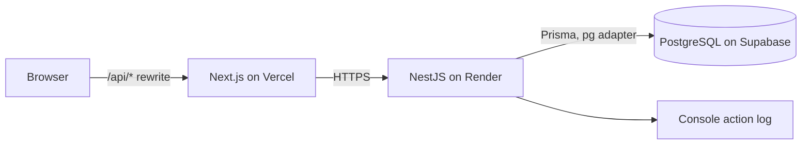
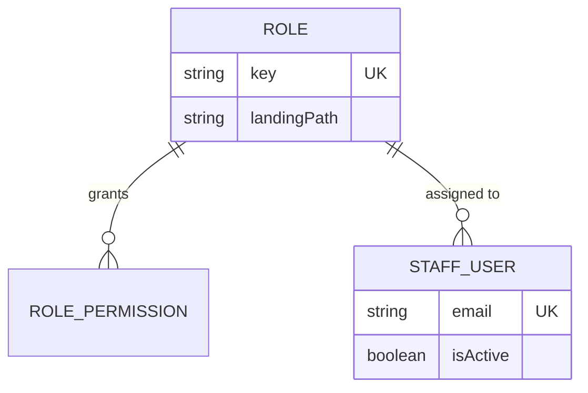
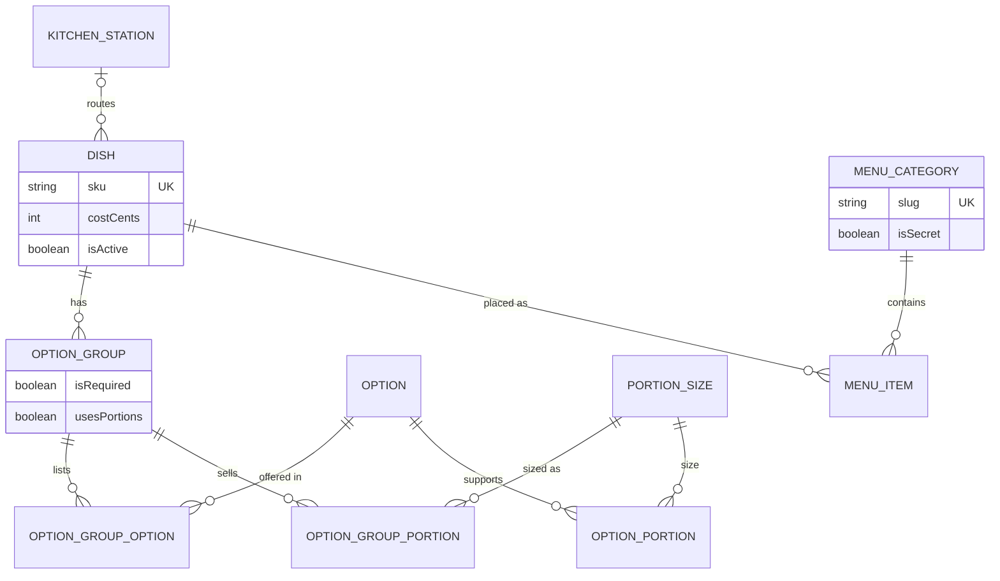
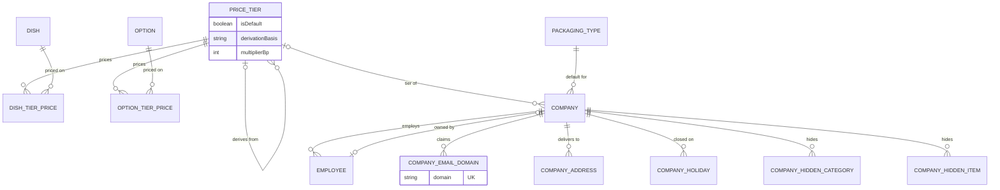
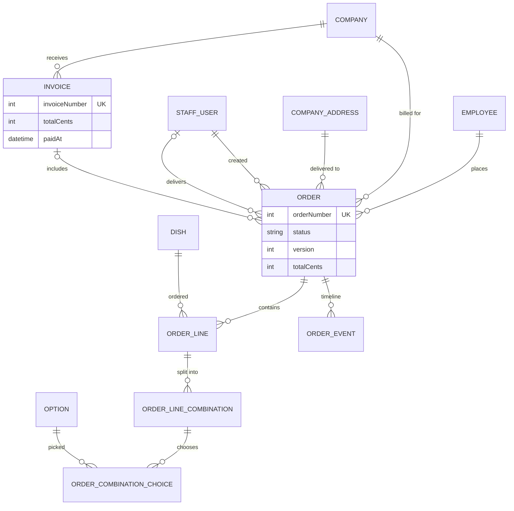

# Fernleaf Kitchen Admin Panel

Internal admin panel for a commercial kitchen that runs corporate meal programs: catalogue, per-company pricing, menus, orders with cut-off, kitchen and dispatch boards, a driver view and company billing.
Built for the Heizen engineering assignment with Next.js, NestJS and Prisma.

|            |                                                |
| ---------- | ---------------------------------------------- |
| Live app   | https://kitchen-fernleaf.vercel.app/           |
| API health | https://kitchen-fernleaf.vercel.app/api/health |
| Repository | https://github.com/darshilptl/fernleaf-kitchen |
| Time zone  | `Asia/Kolkata` for every date calculation      |

## A note on timing

The deadline for this assignment was 4 October 2026, 11:59 PM IST. "I finished after the deadline, about 3 hours late." I would rather say so plainly than let the commit history say it for me.

The brief deliberately asks for more than fits in the time, so I chose depth over breadth: a data model with database-level constraints, business rules written as small tested pure functions, and tests against a real PostgreSQL database for the concurrency rules. That order put the operational screens (kitchen, dispatch, billing, dashboards) last, and finishing them took the extra hours.

## Status at a glance

| Area                                                              | PDF §    | Status |
| ----------------------------------------------------------------- | -------- | ------ |
| Roles, permissions, staff accounts                                | 3        | Built  |
| Catalogue (dishes, options, groups, reference lists)              | 4.1      | Built  |
| Menu (categories, hiding, secret category, preview)               | 4.2      | Built  |
| Pricing (tiers, rules, 5-cent rounding, grid)                     | 4.3      | Built  |
| Companies and employees (domains, calendar, defaults, CSV import) | 4.4, 4.5 | Built  |
| Settings and kitchen calendar                                     | 4.10     | Built  |
| Orders, cut-off, overrides, timeline                              | 4.6      | Built  |
| Kitchen board                                                     | 4.7      | Built  |
| Dispatch board and driver view                                    | 4.8      | Built  |
| Billing and invoices                                              | 4.9      | Built  |
| Dashboards                                                        | 4.11     | Built  |
| Seeded realistic data, live deployment, four test accounts        | 2        | Built  |

## Test accounts

| Role     | Email             | Password  |
| -------- | ----------------- | --------- |
| Admin    | admin@test.com    | Test@1234 |
| Kitchen  | kitchen@test.com  | Test@1234 |
| Dispatch | dispatch@test.com | Test@1234 |
| Driver   | driver@test.com   | Test@1234 |

Each account holds only its own role's permissions, enforced on the server. The API runs on a free tier, so the first request after a quiet period can take up to a minute while it wakes.

## Suggested five-minute tour

1. **Admin, Pricing:** three tiers. Standard is typed and default, Enterprise is "Standard + 15%", Partner is "cost x 2.4". Open each grid: values are `MANUAL`, `DERIVED` or `NONE`. Overnight Oats Jar has no Standard price, so it is `NONE` on Standard and Enterprise but `DERIVED` on Partner. Try "missing prices only".
2. **Admin, Menu, preview:** compare Riya Shah (Acme Foods, Enterprise) with Ishaan Gupta (Initech Labs, Partner): different prices for the same dishes. Maya Rao (Globex) has no Desserts (category hidden); Initech hides one dessert item. Open the secret category with its slug `chefs-table`.
3. **Admin, Companies:** Acme Foods has two domains-rules, two addresses, a holiday and six employees. Try adding `gmail.com` or a domain another company owns: both are rejected.
4. **Orders** [CONFIRM]: create an order for Riya, split a dish into combinations, place it. To see the cut-off without waiting: Settings, set the day count to 0, press "Run cut-off" on Orders, and press it again: the second run changes nothing.
5. **Kitchen, Dispatch, Driver, Billing** [CONFIRM]: start and finish prep units, assign a driver to a drop and move it out, mark it delivered as `driver@test.com`, then invoice the company and mark it paid.

## Stack

| Layer    | Choice                                                                                                   |
| -------- | -------------------------------------------------------------------------------------------------------- |
| Frontend | Next.js (App Router), Tailwind CSS v4 tokens, shadcn/ui, react-hook-form, TanStack Query, Zod            |
| Backend  | NestJS (ESM), Prisma 7 with the `pg` adapter, Zod validation pipe                                        |
| Database | PostgreSQL (Supabase)                                                                                    |
| Shared   | `packages/shared`: permission keys, money, time, cut-off, pricing math, Zod schemas (pure TypeScript)    |
| Tooling  | pnpm workspaces, Turborepo, Vitest, oxlint and ESLint, strict TypeScript with `noUncheckedIndexedAccess` |
| Hosting  | Vercel (web), Render (API), Supabase (database)                                                          |

## Local setup

Prerequisites: Node 22, pnpm.

```bash
pnpm install
cp apps/api/.env.example apps/api/.env          # fill the keys below
cp apps/web/.env.example apps/web/.env.local
pnpm --filter api exec prisma migrate deploy    # applies the tables and the constraints migration
pnpm --filter api db:seed                       # [CONFIRM script name] reference data, catalogue, tiers, companies, menu, orders
pnpm dev
```

| Key                                    | Used by | Meaning                                                                     |
| -------------------------------------- | ------- | --------------------------------------------------------------------------- |
| `DATABASE_URL`                         | api     | Pooled connection used at runtime                                           |
| `DIRECT_URL`                           | api     | Direct or session connection used by the Prisma CLI                         |
| `JWT_SECRET`                           | api     | Signing key for the session cookie                                          |
| `PORT`                                 | api     | Listen port                                                                 |
| `TEST_DATABASE_URL`, `TEST_DIRECT_URL` | tests   | A separate, disposable database. Tests refuse to run against `DATABASE_URL` |
| `API_URL`                              | web     | API origin used by the `/api/*` rewrite (set before building)               |
| `NEXT_PUBLIC_REPO_URL`                 | web     | Repository link used in the footer                                          |

Quality gates: `pnpm check-types`, `pnpm lint`, `pnpm test`, and `pnpm test:tz` [CONFIRM] (runs the suite under two time zones). Last recorded run: {{TEST_COUNTS}} [CONFIRM].

## Architecture



- **Next.js is UI only.** No database access and no business logic; the browser reaches the API through a rewrite, so the session cookie is first-party.
- **NestJS owns every rule.** Controller (permission and parsing), service (orchestration and transactions), domain functions (pure, no framework, no clock, no database).
- **`packages/shared` holds the rules both sides need** (money, cut-off, calendar, pricing math, schemas), so each rule has exactly one implementation.
- **Authorization is by permission key, never by role name.** A role is a named set of keys, so adding a role needs no code change. The session is a JWT carrying only the user id; permissions are loaded on every request, so deactivation takes effect immediately.
- **Errors** share one shape, `{ code, path, message }[]`, which the forms map back to fields. **Logging** is console-only: one line per request and per state-changing action, never secrets.

```
apps/api/    NestJS modules: auth, staff, catalogue, pricing, companies, employees, menu, settings, orders, kitchen, dispatch, billing [CONFIRM]
apps/web/    Next.js app: routes, features, data hooks, API client
packages/shared/   pure rules and schemas      packages/ui/   shadcn components
docs/        DECISIONS.md, module plans, UI shell contract
```

## Data model

Core rules in the model: money is integer cents; orders **snapshot** names and prices, so catalogue or price edits never change past orders; derived prices are computed on read, not stored; a dish and its menu placement are separate; drops are a grouping query, not a table.









Invariants the database itself enforces (a hand-written SQL migration on top of Prisma): one default price tier, one active default address per company, case-insensitive unique names, a fulfilment-step chain (a step cannot be set before the previous one), and non-negative money and positive quantities.

## Business rules and where they are enforced

| Rule                                                                                                                                                                                                    | PDF § | Enforced in                                                        | Proven by                                              |
| ------------------------------------------------------------------------------------------------------------------------------------------------------------------------------------------------------- | ----- | ------------------------------------------------------------------ | ------------------------------------------------------ |
| Derived price rounds **up** to the next 5 cents: cost 310 x 2.4 gives 745, 184 x 1.15 gives 215; typed prices are not rounded                                                                           | 4.3   | `packages/shared` (integer math), pricing domain                   | Pricing tests [CONFIRM names]                          |
| A dish with no price on the employee's tier is never shown (no `$0`, no blank); no fallback to the default tier                                                                                         | 4.3   | One menu resolver used by preview, order form and order validation | Menu resolver tests                                    |
| Combination quantities sum exactly to the line quantity; every required group satisfied; combinations distinct                                                                                          | 4.1   | Order draft validation                                             | Combination tests [CONFIRM]                            |
| Price of a combination = (dish + option prices) x quantity; example 6 brown + 4 jeera of a 7.45 dish with a 0.50 option = 76.50                                                                         | 4.1   | One pricing function in `packages/shared`                          | Totals reconcile test                                  |
| Cut-off: step back the configured kitchen working days, skipping kitchen holidays and non-working days; Wednesday delivery with 2 days at 16:00 locks Monday 16:00; the company calendar never moves it | 4.6   | `cutoffInstant` in `packages/shared`                               | Five worked checks, run under two time zones [CONFIRM] |
| Lock is computed from the clock, so protection holds even if the processing job has not run                                                                                                             | 4.6   | `isLocked(now >= cut-off)`                                         | Lock tests                                             |
| Cut-off processing is idempotent and can be triggered manually                                                                                                                                          | 4.6   | Conditional updates with `RETURNING`, per delivery date            | Run-twice and parallel tests [CONFIRM]                 |
| Kitchen unit cannot be started or finished twice; the order is ready only when every unit is done                                                                                                       | 4.7   | Conditional updates under a row lock on the parent order           | Parallel "done" test [CONFIRM]                         |
| Dispatch steps need the previous step; "out for delivery" needs a driver; steps apply to a whole drop                                                                                                   | 4.8   | Whole-drop transaction plus a database CHECK                       | Chain tests [CONFIRM]                                  |
| An order is on at most one invoice; totals reconcile                                                                                                                                                    | 4.9   | Single nullable `invoiceId`, locked-row invoice creation           | Invoicing tests [CONFIRM]                              |

## Non-functional requirements (PDF section 7)

| Requirement          | How it is met                                                                                                                                                         |
| -------------------- | --------------------------------------------------------------------------------------------------------------------------------------------------------------------- |
| Correctness of money | Integer cents everywhere, one parse/format module, totals recomputed and asserted equal to stored totals                                                              |
| Time zones           | One kitchen zone, `Asia/Kolkata`; "today" only through `kitchenToday()`; dates handled as `YYYY-MM-DD`; suite runs under two zones [CONFIRM]                          |
| Concurrency          | Conditional updates (`WHERE status = expected`), optimistic `version` on orders (409 on conflict), row locks for kitchen and dispatch steps, tests on a real database |
| Validation           | Shared Zod schemas on the server; errors shaped as `{ code, path, message }` and shown at the field                                                                   |
| Performance          | Server-side pagination on every list (`pageSize` max 100); kitchen board is one indexed query                                                                         |
| Code quality         | Strict TypeScript with no `any`, module boundaries, `check-types` and lint at zero warnings                                                                           |
| Tests                | Vitest in `packages/shared` and `apps/api`; real PostgreSQL for service tests; {{TEST_COUNTS}} [CONFIRM]                                                              |

## Key decisions and trade-offs

The full log with reasons and alternatives is [`docs/DECISIONS.md`](docs/DECISIONS.md). The ones that shape the system most:

- **Derived prices are computed on read** (D-10): never stale, no recompute job; safe because orders snapshot prices.
- **No fallback to the default tier** (D-13): a company whose tier lacks a price simply does not see the dish, which is what the brief's "must not appear" rule says.
- **Drops are a grouping query** (D-69): no `Drop` table to keep in sync; steps apply to all orders of a drop in one transaction.
- **Every save of an order reprices it; viewing never does** (D-51).
- **After cut-off an admin can cancel, reject and change time, address or packaging, but not edit lines** (D-60): line edits would collide with kitchen progress and invoices.
- **Each order stores its own company** (D-29): billing follows the order, and an employee cannot move company while draft or placed orders exist.
- **Permission keys, not role names** (D-01), with permissions loaded per request (D-02).
- **Admin holds every permission except being assignable as a driver** (D-75).

## Interpretations of ambiguous requirements

| Brief says                                     | Interpreted as                                                                    | ID   |
| ---------------------------------------------- | --------------------------------------------------------------------------------- | ---- |
| "Round up to the next 5 cents"                 | Ceiling to a multiple of 5; already-aligned values unchanged                      | D-11 |
| "Secret category … can still be reached"       | Unlisted, opened by slug; all other rules still apply                             | D-35 |
| "Hidden from specific companies" for an item   | Hides that placement; a dish in several categories stays orderable via the others | D-34 |
| Cut-off "kitchen working days before delivery" | Count back from, not including, the delivery date; 0 allowed                      | D-44 |
| "Rejected" status                              | Admin-only, terminal, reason required, not billable                               | D-52 |
| "Confirmed order … billable"                   | Confirmed or Delivered, not yet invoiced                                          | D-53 |
| "At-risk" kitchen work                         | Open work within `atRiskMinutes` before its planned ready time                    | D-68 |
| "On time" delivery                             | Delivered at or before the scheduled time, no grace period                        | D-71 |
| Option with no price on a tier                 | Not selectable; dish hidden if a required group is left empty                     | D-15 |
| Portion extra charge                           | One flat charge per size per group, not tiered                                    | D-06 |

## Invoiced orders that later change (PDF 4.9)

The invoice total is frozen when it is created. An invoiced order **cannot be cancelled or rejected**; the admin first removes it from an **unpaid** invoice (the total is recalculated, and an invoice left empty is deleted). **Paid invoices are immutable.** Changing time, address or packaging is allowed because it has no billing effect. A delivered order that turns out short is **not modelled**: it stays billed in full, and a credit note is the natural next step (D-74).

## Dashboard definitions (PDF 4.11)

Common rules: date basis is the delivery date in the kitchen zone; money is the order total in cents; missing or not-applicable data shows "n/a", never 0; operational figures count Confirmed orders (Delivered where stated).
[CONFIRM: every figure below matches what is implemented; delete or correct any that does not.]

| Role     | ID  | Figure                               | Why this person needs it         | Calculation                                                                         |
| -------- | --- | ------------------------------------ | -------------------------------- | ----------------------------------------------------------------------------------- |
| Admin    | A1  | Orders by status, today to today + 6 | See the pipeline                 | Count of orders per status by delivery date; all six statuses shown, zeros included |
| Admin    | A2  | Unbilled total and top 5 companies   | Know what to invoice             | Sum of `totalCents` of Confirmed or Delivered orders with no invoice, per company   |
| Admin    | A3  | Unpaid invoices                      | Chase payment                    | Count, sum, and age in days of the oldest (today minus creation date)               |
| Admin    | A4  | Pricing gaps                         | Find dishes customers cannot see | Active dishes with no effective price on the default tier                           |
| Kitchen  | K1  | Today's units                        | Plan the shift                   | Total, not started, in progress, done, over Confirmed orders for today              |
| Kitchen  | K2  | Late and at-risk units               | Act first on what is slipping    | Open units past their planned ready time (late) or within `atRiskMinutes` of it     |
| Kitchen  | K3  | Open units by station                | Balance the stations             | Open units grouped by station, including "Unassigned"                               |
| Kitchen  | K4  | Next planned ready times             | See what is due next             | Five earliest open planned ready times                                              |
| Dispatch | P1  | Today's drops by stage               | See the floor at a glance        | Drops grouped by company, address and time; stage is the least advanced order       |
| Dispatch | P2  | Drops without a driver               | Assign before they leave         | Drops where any order has no driver                                                 |
| Dispatch | P3  | Drops past planned dispatch-ready    | Catch delays                     | Not out for delivery after delivery time minus the company lead time                |
| Dispatch | P4  | On-time deliveries today             | Quality of the day               | Delivered on time over delivered; "n/a" if none                                     |
| Driver   | R1  | My drops today                       | Do the route                     | My assigned drops in time order with stage, remaining count, next delivery          |

**Deliberately not shown:** revenue charts and margins (cost is not billed), tomorrow's prep forecast (processing may still change it), per-worker output and driver utilisation (not tracked).

## Prioritisation notes

- **Built:** everything in the status table marked Built.
- **Not built, and why:** portions ([Should]; the schema supports them, the API rejects them with `CATALOGUE_PORTIONS_DEFERRED` rather than half-implementing the invariant); credit notes for short deliveries (outside the brief's money model); [CONFIRM: delivery photo upload, if not built].
- **Next, in order:** portions; credit notes; a persisted audit trail (the brief excludes it, but billing would benefit); end-to-end browser tests.
- **How the order was chosen:** the data model and rules first, because the brief says rules matter more than screens; then the money path (catalogue, pricing, menu); then orders and the floor; dashboards and seed data last.

## How this was built

AI tools were used heavily and deliberately. The repository carries the rules the agents worked under: [`AGENTS.md`](AGENTS.md) (architecture boundaries, coding standard, invariants), 14 skill files under `.agents/skills`, and a decision log. Each group of modules went through plan, audit against the brief and the log, my approval, execution, type-check, lint and test gates, a manual check by me, and only then a commit. I reviewed each plan and ran each manual check, and I can explain any line.

## Known limitations

- Free-tier hosting: the API may take up to a minute to wake after inactivity.
- One kitchen time zone for every company (stated assumption).
- The four seed accounts are re-asserted on every boot, so a reviewer who deactivates one will find it restored after a restart.
- A delivered order that turns out short is billed in full (see above).

## Deployment

Vercel builds `apps/web` with `API_URL` pointing at the Render service (set before the build, because the rewrite reads it at build time). Render builds the workspace, runs `prisma migrate deploy` on start, and checks `/api/health`. Secrets live in the platforms' environment settings only.
